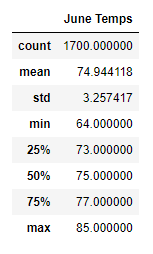
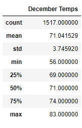

## Surfs Up

# Overview of the analysis: 
Purpose of this analysis is to provide evidence that the ice cream and surf shop is sustainable year-round 
by reviewing temperatures in June and December. 

# Results: 
    1. June average temperature is close to 75 degrees with a standard deviation of 3.25 degrees and 
    75% of the recorded June temperatures in 77 degrees. 

    2. December average temperature is 71 degrees with a standard deviation of 3.74 degrees. 
    The max temperature is 83 degrees with 75% of temperatures measured to be 74 degrees. 

    3. Both months have max temperatures measured in the 80's however December has seen lows temperatures 
    of 56 degrees and June with lows in 64 degrees. 

# Summary:
Overall, the temperatures recorded showcases that the shop can be sustainable through out the year with 
averages temperatures in the 70's. Two additional queries that would help in determining sustainability 
through the year would be to analyze the volume of precipitation and the frequency of precipitation during these two months.
These two queries would assist in forecasting the potential volume of business during these two months based on the weather forecast.  